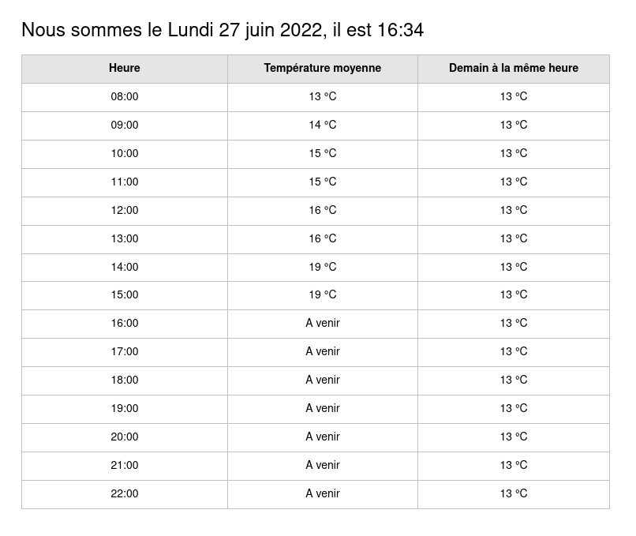
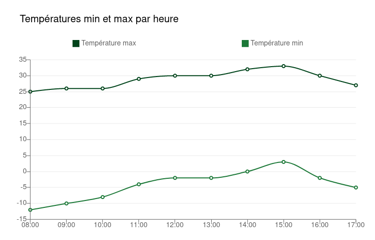
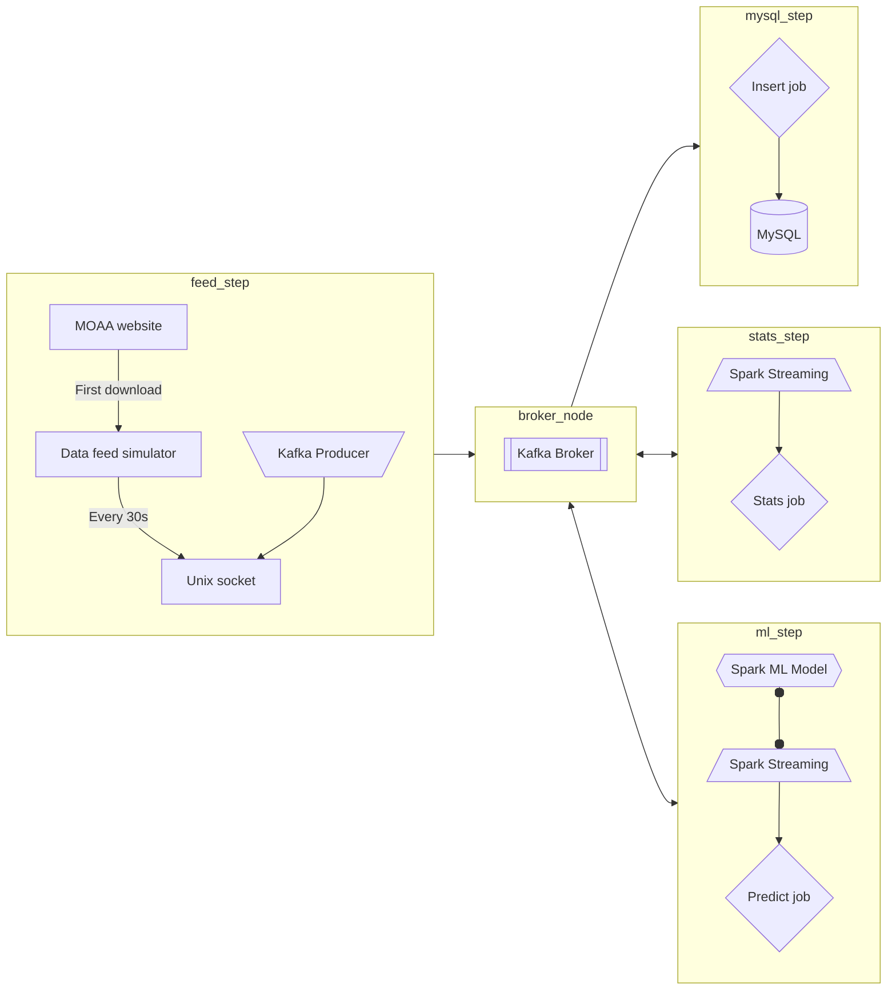
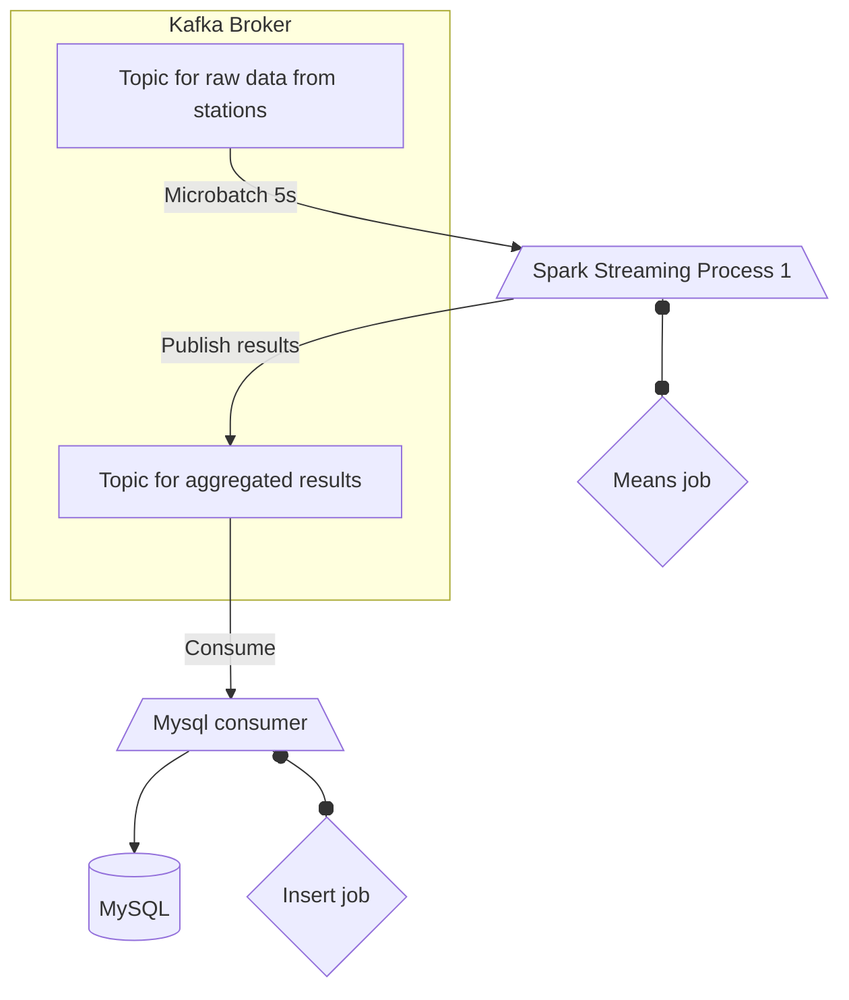

# About

This repository is a proof of work for a Kappa architecture, which is an event based architecture to handle real-time data processing.

It uses following stack :

- Spark Streaming as the data processer,
- Kafka broker as a message broker,
- MySQL to store processed data in a data warhouse,
- Python flask to expose some API routes,
- VueJS to create the user interface and see calculated data.

The data comes from NOAA meteorological data : <https://www.ncei.noaa.gov/cdo-web/>. It shows temperatures from several meteo stations scattered around the world, hour by hour.

A data feed simulator sends this data in little batches every 30 seconds. Those batches are used to calculate ongoing means, max and min temperatures by jours, with Spark Streaming. The results are then stored to MySQL and showed to end users.

Cf. <https://app.moqups.com/a5r0wjvSgi4Xyx94Z7zfuXo2I4Oefjr4/edit/page/ad64222d5>





# Speed Layer (Kappa achitecture)

## Architecture overview

Speed layer : Kappa



Essentially, the streaming pipeline is as following :

- => Download Data from MOAA API
- => Push data to socket
- => Listen to socket and push data back to Kafka
- => Consume message and do calculation (spark streaming)
- => Push calculation results back to Kafka
- => Consume message and insert in MySQL

Spark Streaming:
- calculates temperatures by hour (min/max + mean), and store it to MySQL
- (TODO) predicts temperatures by hour for next day, and store it to MySQL

Kakfa broker:
- must keep all data it receives for 7 days

More details on the stats and mysql steps :



## ML Model

> TODO

Spark Streaming handle input of data, and pass it to a Spark ML model to get predictive results.

If possible, a Spark ML model is trained upon each interations, when new data comes. If not, leave it for batch layer.

## Get started

First, you need to open unix socket :

```shell
py -m app.speed_layer.feed.server_socket
```

Then, you need to launch a feed simulator. This is a process that will *simulate* a streaming of data,
in order to process it later with Spark Streaming :

```shell
py -m app.speed_layer.feed.client_socket_v2
```

> The script first dowload the data from MOAA API, then
> feed it to the data pipeline

Don't forget to choose how many stations you want to process:

```python
# app/speed_layer/feed/client_socket_v2.py
def download_today_data():
    number_of_statoins = 100  # how many stations you want to retrieve
```

Then, you need to launch Spark Streaming process, in order to process all that data, i.e.
calculate means, max/min, etc. :

```shell
py -m app.speed_layer.stats_step.spark_streaming_consumer
```

> Please remember that the folder `app/speed_layer/stats_step/checkpoint/` contains checkpoints
> of previous spark streaming calculation. That means that spark streaming will reuse the former
> calculation before doing new ones. If you cant to avoid this, i.e. start from scratch, simply
> delete this folder, and spark will create a new one.

Finally, to save the results in MySQL DB, you need to launch yet another process :

```shell
py -m app.speed_layer.insert_step.tmp_hourly
```

## Stats

The agregated values that we are going to calcultate are :
- min / max TMP of the current hour
- mean TMP of the current hour

# Batch Layer (Lambda architecture)

> On top of the speed layer, there is a batch layer that will calculate and show the same values (mean, max, min) but for the whole period of time, i.e. for the X last years, depending on how many years of data you choose to download.

> Theses stats are shown in a separate tab view

First, you need to download the data from MOAA website :

```shell
python -m app.batch_layer.download_csv
```

Then, you need to import that data into Hadoop :

```shell
# From webappbackend container
python -m app.batch_layer.hdfs_client
```

Then, you need to calculate all the intermediate values with Spark :

```shell
py -m app.batch_layer.agregats
```

Those results are inserted in MySQL, and showed in frontend.
