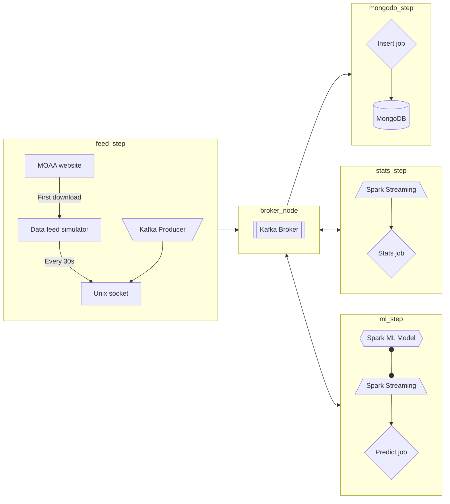

# ipssi-moaa

Pour exporter son juptyer notebook en .py :

`jupytext --format-options notebook_metadata_filter="-all" --to py:percent <filename>.ipynb`

Pour exporter un fichier .py en juptyer notebook :

`jupytext --to ipynb <filename>.py`

Ne pas commiter les jupyter notebook. Commiter les .py.

# Speed Layer (Kappa achitecture)

## Architecture overview

Speed layer : Kappa

Every 30s the data from MOAA website (dowloaded once separately) is splitted and sent to Unix socket.

Split rules :
- by hour
- incrementalyspark_streaming_ml
- select every probes
- from 01/01/2020 to 31/12/2020 (during one year) 

Python : Push data to socket
Python: Listen to socket

The producter listen to socket, retrieve the data and publish it to Kafka.

Spark Streaming:
- calculates temperatures by hour (min/max + mean), and store it to MongoDB
- predicts temperatures by hour for next day, and store it to MongoDB

Kakfa broker:
- keep all data it receives for 7 days

## Model

Spark Streaming handle input of data, and pass it to a Spark ML model to get predictive results.

If possible, a Spark ML model is trained upon each interations, when new data comes. If not, leave it for batch layer.

## Stats

The agregated values that we are going to calcultate are :
- min / max TMP of the current hour
- mean TMP of the current hour

## UI

Cf. <https://app.moqups.com/a5r0wjvSgi4Xyx94Z7zfuXo2I4Oefjr4/edit/page/ad64222d5>

